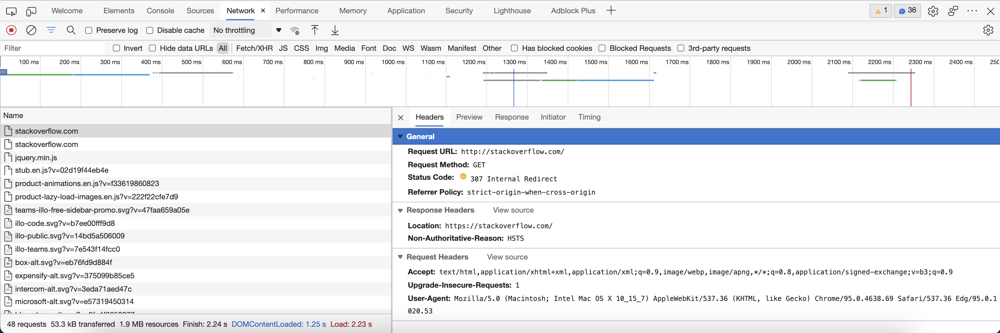
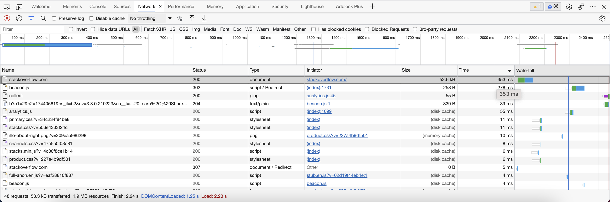
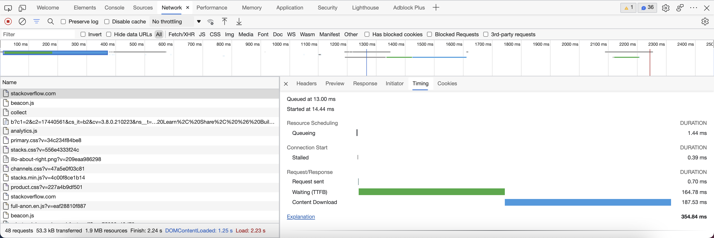

### Домашнее задание к занятию "3.6. Компьютерные сети, лекция 1"

#### 1. Работа c HTTP через телнет.
- Подключитесь утилитой телнет к сайту stackoverflow.com telnet stackoverflow.com 80
- отправьте HTTP запрос
```shell
GET /questions HTTP/1.0
HOST: stackoverflow.com
[press enter]
[press enter]
```
- В ответе укажите полученный HTTP код, что он означает?  

```shell
$ telnet stackoverflow.com 80
Trying 151.101.129.69...
Connected to stackoverflow.com.
Escape character is '^]'.
GET /questions HTTP/1.0
HOST: stackoverflow.com

HTTP/1.1 301 Moved Permanently
cache-control: no-cache, no-store, must-revalidate
location: https://stackoverflow.com/questions
x-request-guid: 6b722bf1-5548-4c23-8783-e7dd3eac8a43
feature-policy: microphone 'none'; speaker 'none'
content-security-policy: upgrade-insecure-requests; frame-ancestors 'self' https://stackexchange.com
Accept-Ranges: bytes
Date: Fri, 26 Nov 2021 15:19:58 GMT
Via: 1.1 varnish
Connection: close
X-Served-By: cache-fra19171-FRA
X-Cache: MISS
X-Cache-Hits: 0
X-Timer: S1637939998.255844,VS0,VE92
Vary: Fastly-SSL
X-DNS-Prefetch-Control: off
Set-Cookie: prov=3b058312-43f7-622e-8757-90187bed30db; domain=.stackoverflow.com; expires=Fri, 01-Jan-2055 00:00:00 GMT; path=/; HttpOnly

Connection closed by foreign host.
```
В ответ получили код 301 - редирект с HTTP на HTTPS протокол того же url

#### 2. Повторите задание 1 в браузере, используя консоль разработчика F12.
- откройте вкладку Network
- отправьте запрос http://stackoverflow.com
- найдите первый ответ HTTP сервера, откройте вкладку Headers
- укажите в ответе полученный HTTP код.
- проверьте время загрузки страницы, какой запрос обрабатывался дольше всего?
- приложите скриншот консоли браузера в ответ.  



В ответ получили код 307 (Temporary Redirect)



Страница полностью загрузилась за 2.24 сек. Самый долгий запрос - начальная загрузка страницы 353 мс



#### 3. Какой IP адрес у вас в интернете?

```shell
$ dig @resolver4.opendns.com myip.opendns.com +short
82.102.xxx.xxx
```

#### 4. Какому провайдеру принадлежит ваш IP адрес? Какой автономной системе AS? Воспользуйтесь утилитой whois

```shell
$ whois 82.102.xxx.xxx | grep ^descr
descr:          PrimeTel PLC
```
IP адрес принадлежит ISP PrimeTel PLC
```shell
$ whois 82.102.xxx.xxx | grep ^origin
origin:         AS8544
```
AS - AS206912

#### 5. Через какие сети проходит пакет, отправленный с вашего компьютера на адрес 8.8.8.8? Через какие AS? Воспользуйтесь утилитой traceroute

```shell
$ traceroute -An 8.8.8.8
traceroute to 8.8.8.8 (8.8.8.8), 30 hops max, 60 byte packets
 1  10.0.2.2 [*]  0.580 ms  0.453 ms  0.537 ms
 2  172.20.10.1 [*]  25.259 ms  25.239 ms  29.771 ms
 3  * * *
 4  10.95.130.98 [*]  109.653 ms  109.633 ms  109.614 ms
 5  10.95.130.209 [*]  109.594 ms  109.573 ms  109.552 ms
 6  78.158.134.114 [AS8544]  119.005 ms  107.965 ms  107.917 ms
 7  78.158.141.157 [AS8544]  187.849 ms  124.968 ms  124.899 ms
 8  78.158.141.141 [AS8544]  124.369 ms  124.188 ms  123.989 ms
 9  * * *
10  8.8.8.8 [AS15169]  123.991 ms  123.943 ms  123.758 ms
```
Пакет проходит через AS - AS8544, AS15169

```shell
$ grep org-name <(whois AS8544)
org-name:       Primetel PLC
$ grep OrgName <(whois AS15169)
OrgName:        Google LLC
```

#### 6. Повторите задание 5 в утилите mtr. На каком участке наибольшая задержка - delay?

```shell
$ mtr 8.8.8.8 -znrc 1
Start: 2021-11-26T15:17:47+0000
HOST: vagrant                     Loss%   Snt   Last   Avg  Best  Wrst StDev
  1. AS???    10.0.2.2             0.0%     1    0.4   0.4   0.4   0.4   0.0
  2. AS???    172.20.10.1          0.0%     1    5.7   5.7   5.7   5.7   0.0
  3. AS???    ???                 100.0     1    0.0   0.0   0.0   0.0   0.0
  4. AS???    10.95.130.98         0.0%     1   29.2  29.2  29.2  29.2   0.0
  5. AS???    10.95.130.209        0.0%     1   43.0  43.0  43.0  43.0   0.0
  6. AS8544   78.158.134.114       0.0%     1   48.0  48.0  48.0  48.0   0.0
  7. AS8544   78.158.141.157       0.0%     1  121.2 121.2 121.2 121.2   0.0
  8. AS8544   78.158.141.141       0.0%     1  110.6 110.6 110.6 110.6   0.0
  9. AS15169  108.170.236.175      0.0%     1   97.4  97.4  97.4  97.4   0.0
 10. AS15169  142.250.229.59       0.0%     1   88.4  88.4  88.4  88.4   0.0
 11. AS15169  8.8.8.8              0.0%     1   94.6  94.6  94.6  94.6   0.0
```
Наибольшая задержка на 7 хопе

#### 7. Какие DNS сервера отвечают за доменное имя dns.google? Какие A записи? воспользуйтесь утилитой dig

```shell
$ dig +short NS dns.google
ns4.zdns.google.
ns2.zdns.google.
ns1.zdns.google.
ns3.zdns.google.
```
NS записи

```shell
$ dig +short A dns.google
8.8.4.4
8.8.8.8
```
A записи

#### 8. Проверьте PTR записи для IP адресов из задания 7. Какое доменное имя привязано к IP? воспользуйтесь утилитой dig

```shell
$ for ip in `dig +short A dns.google`; do dig -x $ip | grep ^[0-9].*in-addr; done
8.8.8.8.in-addr.arpa.	18561	IN	PTR	dns.google.
4.4.8.8.in-addr.arpa.	21274	IN	PTR	dns.google.
```
dns.google