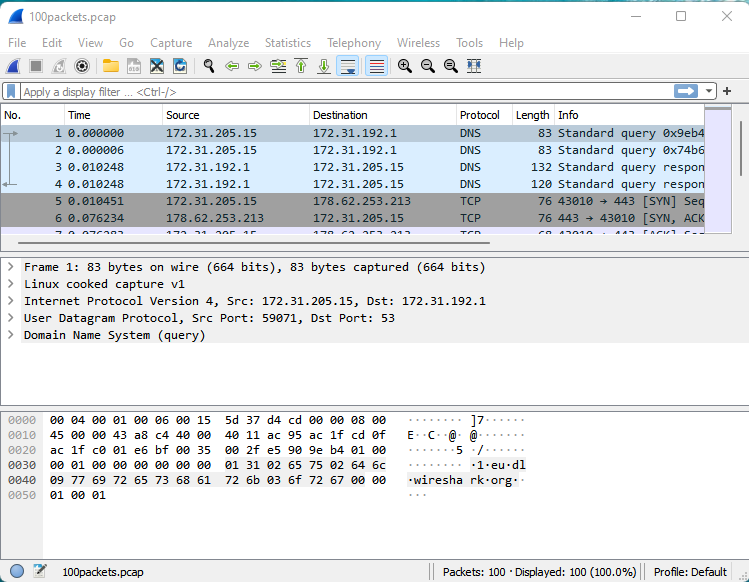

### Домашнее задание к занятию "3.9. Элементы безопасности информационных систем"

#### 1. Установите Bitwarden плагин для браузера. Зарегистрируйтесь и сохраните несколько паролей.

#### 2. Установите Google authenticator на мобильный телефон. Настройте вход в Bitwarden аккаунт через Google authenticator OTP.

#### 3. Установите apache2, сгенерируйте самоподписанный сертификат, настройте тестовый сайт для работы по HTTPS.
```shell
$ sudo apt install apache2
```
```shell
$ sudo openssl req -x509 -nodes -days 365 -newkey rsa:2048 -keyout /etc/ssl/private/apache-selfsigned.key -out /etc/ssl/certs/apache-selfsigned.crt
Generating a RSA private key
.............+++++
................+++++
writing new private key to '/etc/ssl/private/apache-selfsigned.key'
-----
.....
```
```shell
$ sudo nano /etc/apache2/conf-available/ssl-params.conf
SSLCipherSuite EECDH+AESGCM:EDH+AESGCM:AES256+EECDH:AES256+EDH
SSLProtocol All -SSLv2 -SSLv3 -TLSv1 -TLSv1.1
SSLHonorCipherOrder On
# Disable preloading HSTS for now.  You can use the commented out header line that includes
# the "preload" directive if you understand the implications.
# Header always set Strict-Transport-Security "max-age=63072000; includeSubDomains; preload"
Header always set X-Frame-Options DENY
Header always set X-Content-Type-Options nosniff
# Requires Apache >= 2.4
SSLCompression off
SSLUseStapling on
SSLStaplingCache "shmcb:logs/stapling-cache(150000)"
# Requires Apache >= 2.4.11
SSLSessionTickets Off
```
```shell
$ sudo cp /etc/apache2/sites-available/default-ssl.conf /etc/apache2/sites-available/default-ssl.conf.bak
$ sudo nano /etc/apache2/sites-available/default-ssl.conf
<IfModule mod_ssl.c>
        <VirtualHost _default_:443>
                ServerAdmin your_email@example.com
                ServerName localhost

                DocumentRoot /var/www/html

                ErrorLog ${APACHE_LOG_DIR}/error.log
                CustomLog ${APACHE_LOG_DIR}/access.log combined

                SSLEngine on

                SSLCertificateFile      /etc/ssl/certs/apache-selfsigned.crt
                SSLCertificateKeyFile /etc/ssl/private/apache-selfsigned.key

                <FilesMatch "\.(cgi|shtml|phtml|php)$">
                                SSLOptions +StdEnvVars
                </FilesMatch>
                <Directory /usr/lib/cgi-bin>
                                SSLOptions +StdEnvVars
                </Directory>

        </VirtualHost>
</IfModule>
```
```shell
$ sudo nano /etc/apache2/sites-available/000-default.conf
<VirtualHost *:80>
        . . .

        Redirect "/" "https://localhost/"

        . . .
</VirtualHost>
```
```shell
$ sudo a2enmod ssl
$ sudo a2enmod headers
$ sudo a2ensite default-ssl
$ sudo a2enconf ssl-params
$ sudo apache2ctl configtest
$ sudo systemctl restart apache2
```


#### 4. Проверьте на TLS уязвимости произвольный сайт в интернете.
```shell
# docker run --rm -ti  drwetter/testssl.sh -U --sneaky https://ya.ru
...
 Further IP addresses:   2a02:6b8::2:242
 rDNS (87.250.250.242):  ya.ru.
 Service detected:       HTTP


 Testing vulnerabilities

 Heartbleed (CVE-2014-0160)                not vulnerable (OK), no heartbeat extension
 CCS (CVE-2014-0224)                       not vulnerable (OK)
 Ticketbleed (CVE-2016-9244), experiment.  not vulnerable (OK)
 ROBOT                                     not vulnerable (OK)
 Secure Renegotiation (RFC 5746)           supported (OK)
 Secure Client-Initiated Renegotiation     not vulnerable (OK)
 CRIME, TLS (CVE-2012-4929)                not vulnerable (OK)
 BREACH (CVE-2013-3587)                    no gzip/deflate/compress/br HTTP compression (OK)  - only supplied "/" tested
 POODLE, SSL (CVE-2014-3566)               not vulnerable (OK)
 TLS_FALLBACK_SCSV (RFC 7507)              Downgrade attack prevention supported (OK)
 SWEET32 (CVE-2016-2183, CVE-2016-6329)    VULNERABLE, uses 64 bit block ciphers
 FREAK (CVE-2015-0204)                     not vulnerable (OK)
 DROWN (CVE-2016-0800, CVE-2016-0703)      not vulnerable on this host and port (OK)
                                           make sure you don't use this certificate elsewhere with SSLv2 enabled services
                                           https://censys.io/ipv4?q=26EB381642B07A05F7CA935101FC6492F91F7F0721995A8E577EDFB6723EBD1F could help you to find out
 LOGJAM (CVE-2015-4000), experimental      not vulnerable (OK): no DH EXPORT ciphers, no DH key detected with <= TLS 1.2
 BEAST (CVE-2011-3389)                     TLS1: ECDHE-RSA-AES128-SHA AES128-SHA
                                                 DES-CBC3-SHA
                                           VULNERABLE -- but also supports higher protocols  TLSv1.1 TLSv1.2 (likely mitigated)
 LUCKY13 (CVE-2013-0169), experimental     potentially VULNERABLE, uses cipher block chaining (CBC) ciphers with TLS. Check patches
 Winshock (CVE-2014-6321), experimental    not vulnerable (OK)
 RC4 (CVE-2013-2566, CVE-2015-2808)        no RC4 ciphers detected (OK)
```
#### 5. Установите на Ubuntu ssh сервер, сгенерируйте новый приватный ключ. Скопируйте свой публичный ключ на другой сервер. Подключитесь к серверу по SSH-ключу.
```shell
vagrant@netologyVM1:~$ ssh-keygen
Generating public/private rsa key pair.
Enter file in which to save the key (/home/vagrant/.ssh/id_rsa):
....
vagrant@netologyVM1:~$ ssh-copy-id -i .ssh/id_rsa vagrant@172.28.128.60
....
vagrant@netologyVM1:~$ ssh vagrant@172.28.128.60
Welcome to Ubuntu 20.04.2 LTS (GNU/Linux 5.4.0-80-generic x86_64)
....
vagrant@netologyVM2:~$
```
#### 6. Переименуйте файлы ключей из задания 5. Настройте файл конфигурации SSH клиента, так чтобы вход на удаленный сервер осуществлялся по имени сервера.
```shell
vagrant@netologyVM1:~$ sudo mv ~/.ssh/id_rsa ~/.ssh/id_rsa_netology
vagrant@netologyVM1:~$ sudo nano ~/.ssh/config
Host netologyVM2
        HostName 172.28.128.60
        User vagrant
        Port 22
        IdentityFile ~/.ssh/id_rsa_netology
vagrant@netologyVM1:~$ ssh netologyVM2
Welcome to Ubuntu 20.04.2 LTS (GNU/Linux 5.4.0-80-generic x86_64)
....
vagrant@netologyVM2:~$
```
#### 7. Соберите дамп трафика утилитой tcpdump в формате pcap, 100 пакетов. Откройте файл pcap в Wireshark.
```shell
# tcpdump -nnei any -c 100 -w 100packets.pcap
tcpdump: listening on any, link-type LINUX_SLL (Linux cooked v1), capture size 262144 bytes
100 packets captured
178 packets received by filter
0 packets dropped by kernel
```


#### 8*. Просканируйте хост scanme.nmap.org. Какие сервисы запущены?

```shell
# nmap scanme.nmap.org
Starting Nmap 7.80 ( https://nmap.org ) at 2021-12-03 15:52 EET
Nmap scan report for scanme.nmap.org (45.33.32.156)
Host is up (0.22s latency).
Other addresses for scanme.nmap.org (not scanned): 2600:3c01::f03c:91ff:fe18:bb2f
Not shown: 996 closed ports
PORT      STATE SERVICE
22/tcp    open  ssh
80/tcp    open  http
9929/tcp  open  nping-echo
31337/tcp open  Elite

Nmap done: 1 IP address (1 host up) scanned in 2.68 seconds
```
Подняты ssh, web-server, nping-echo server, открыт порт 31337

#### 9*. Установите и настройте фаервол ufw на web-сервер из задания 3. Откройте доступ снаружи только к портам 22,80,443
```shell
vagrant@netologyVM1:~$ sudo ufw status verbose
Status: active
Logging: on (low)
Default: deny (incoming), allow (outgoing), disabled (routed)
New profiles: skip

To                         Action      From
--                         ------      ----
22/tcp (OpenSSH)           ALLOW IN    Anywhere
80,443/tcp (Apache Full)   ALLOW IN    Anywhere
80/tcp (Apache (v6))       ALLOW IN    Anywhere (v6)
22/tcp (OpenSSH (v6))      ALLOW IN    Anywhere (v6)
80,443/tcp (Apache Full (v6)) ALLOW IN    Anywhere (v6)
```